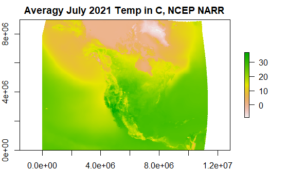
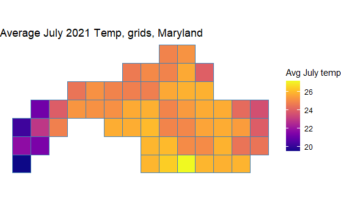
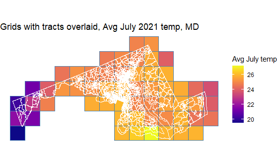
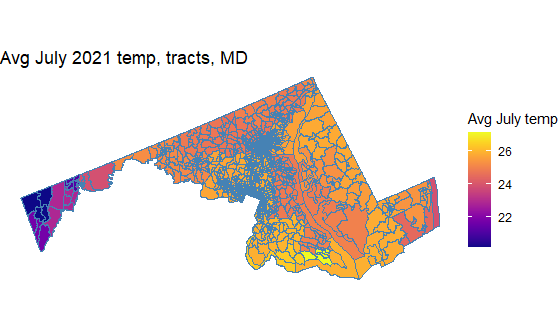

# narr

Ingests NCEP NARR gridded climate data and joins to counties and tracts.

## Download data

.csv files for [counties](data/narr_counties.csv) and [tracts](data/narr_tracts.csv).

## Details

This repo: \
- Ingests [NCEP North American Regional Reanalysis (NARR)](https://psl.noaa.gov/data/gridded/data.narr.html) data on mean air temperature and relative humidity for July 2021.\
- Downloads spatial geographies for counties and tracts from U.S. Census TIGER/Line shapefiles.\
- Spatially joins the gridded NARR data to the county and tract geographies. - Assigns temperature and relative humidity values to counties and tracts using [sf::st_join(..., larger = T)](https://r-spatial.github.io/sf/reference/st_join.html).\
- Calculates wet bulb temperatures for counties and tracts as a function of temperature and humidity according to [Stull (2011)](https://journals.ametsoc.org/view/journals/apme/50/11/jamc-d-11-0143.1.xml).

## Examples

Monthly mean temperature raster from NARR

Gridded NARR temperature data for grids intersecting with the state of Maryland

Grids with tracts overlaid showing spatial join

Final value assignment to tracts. Uses sf::st_join(.., largest = T, left = T).

